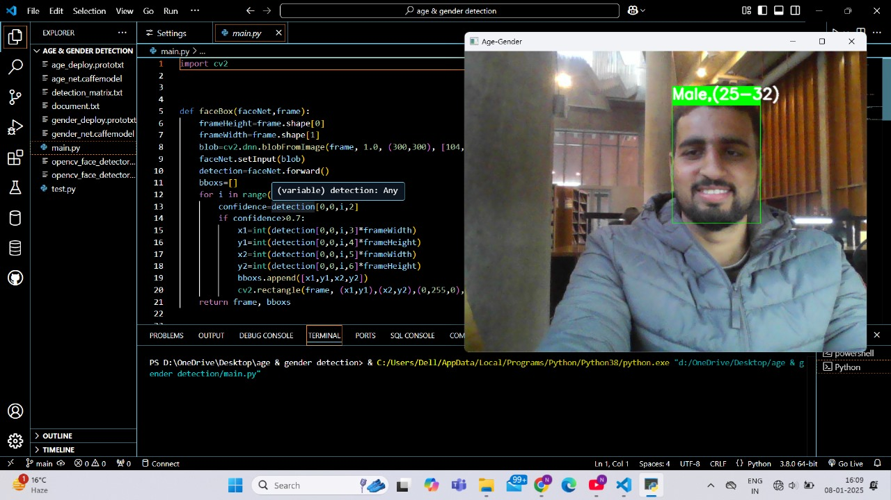
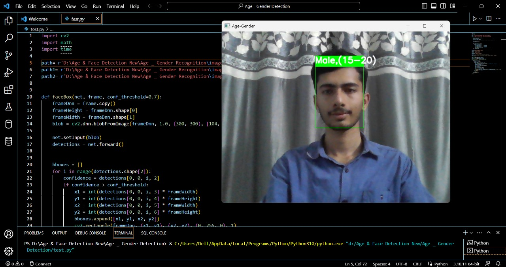

# 🏷️ Age and Gender Detection  

This project utilizes **OpenCV** and **Deep Learning** to detect a person's **age and gender** in real time through a webcam feed or an image.  

  
  

---

## 📌 Features  
✅ **Real-time face detection** using OpenCV  
✅ **Accurate age and gender classification** with a pre-trained Caffe model  
✅ **Supports both webcam and static image inputs**  
✅ **Optimized bounding box detection for better accuracy**  

---

## 🚀 Technologies Used  
🔹 **OpenCV** - For image processing and face detection  
🔹 **Deep Learning Models** - Pre-trained models for age & gender classification  
🔹 **NumPy** - For efficient numerical computations  
🔹 **Python** - Core programming language  

---

